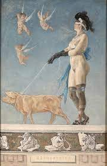

---
aliases:
layout: post
title:
description:
comments:
menu:
tags: 护肤品 保健品
categories:
permanent: 
excerpt: # abstract
timestamp: 202312211351
createdate: 2023-12-21
origindate: 
---

## 护肤配方
#护肤品 #保健品 

精华液 30ml
CBD 200mg
少量波斯玫瑰精油
香草乙酮 300mg

### CBD
Chantecaille CBD 300面部及身體乳霜 HK$1,170 / 50ml
Chantecaille 首款採用藥用大麻二酚(CBD)的產品,每瓶注入 300 毫克廣譜大麻二酚的奢華乳霜,更揉合三款強效科研草本成分,與大麻二酚發揮更強紓緩功效,同時高效潤澤、補濕,呵護乾燥肌膚。
来源：[Jennifer Aniston逆齡靠CBD大麻二酚｜CBD護膚養生的隱藏Q&A | Wellness | Madame Figaro Hong Kong](https://www.madamefigaro.hk/wellness/cbd%e5%a4%a7%e9%ba%bb%e4%ba%8c%e9%85%9a-%e8%ad%b7%e8%86%9a-%e5%8a%9f%e6%95%88-jennifer-aniston-71115/3/)

### 香草乙酮 
促进胶原蛋白

## 其他
#艺术品
艺术印刷品， Félicien Rops

MeisterDrucke - 艺术印刷, 绘画&复制
牵着猪的裸女

潘玉良《海边五裸女》

严恢曰：“所为问道者为富，今得珠亦富矣，安用道？”子列子曰：“桀纣唯重利而轻道，是以亡。幸哉余未汝语也！人而无义，唯食而已，是鸡狗也。疆食靡角，胜者为制，是禽兽也。为鸡狗禽兽矣，而欲人之尊己，不可得也。人不尊己，则危辱及之矣。”
《列子》0说符 | 冲虚经 | 道家
https://www.quanxue.cn/ct_daojia/liezi/liezi08.html