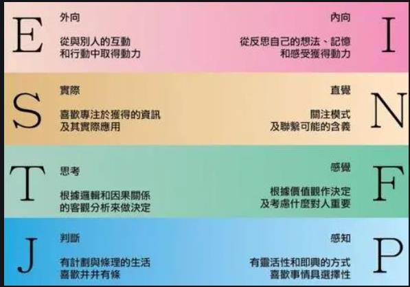

---
aliases:
layout: post
title:
description:
comments:
menu:
tags: 
categories:
permanent: 
excerpt: # abstract
timestamp: 202401041355
createdate: 2024-01-04
origindate: 
---

## 生长激素的周期
生长激素，一天中有两个分泌高峰，**一个是晚间10点至凌晨2点，另一个是清晨5点至7点**

## K1ngs PCT – Olympus Labs
https://olympus-labs.com/products/k1ngs-pct

奥林巴斯实验室 K1ng 的 PCT 240 粒胶囊
份量：8 粒胶囊
每个容器份数：30 

| 中文|英文| 份量|%DV |
|---|---|---|---|
|2-磷酸抗坏血酸镁| Ascorbic Acid-2-Phosphate Magnesium|	380 mg	|/| 
|-  维生素 C（2-磷酸抗坏血酸镁）|Vitamin C (as Ascorbic Acid-2-Phosphate Magnesium)|191mg|212%|
|-  镁（2-磷酸抗坏血酸镁）|Magnesium (as Ascorbic Acid-2-Phosphate Magnesium)|	26 mg	|6%|
|||||
|韩国槲寄生（Viscum album coloratum）（茎）提取物|Korean Mistletoe (Viscum album coloratum) (stem) Extract|2000 mg|/|
|红海藻（Eucheuma cottonil）（叶）提取物|Red Seaweed (Eucheuma cottonil) (frond) Extract|	1200 mg|/|
|管花肉苁蓉（茎）提取物（标准化为 10% 松果菊苷）|Cistanche Tubulosa (stem) Extract (Standardised to 10% Echinacoside)|750 mg| /|
|α-罗酮 10%| Alpha-Lonone 10%|	640 mg |/|
|千日菊	（花头）提取物（标准化为 3.5% 千日菊素）为 SA3X | Spilanthes Acmella (flower head) Extract (Standardised to 3.5% Spilanthol) as SA3X | 500 mg| /|

SA3X能增强HPTA。

## 发酵虫草菌粉的主要应用
https://www.chemicalbook.com/NewsInfo_11265.htm
冬虫夏草是麦角菌科植物冬虫夏草菌的子座及其寄主蝙蛾科昆虫虫草蝙蝠蛾等的幼虫尸体的复合体，具有补虚损、益精气、止咳化痰等功效，是一种传统名贵滋补中药材。
人工培育的发酵虫草菌粉的主要化学成分与冬虫夏草类似，且价格相对较低，已逐渐被大众接受和认可。近年来大量研究发现发酵虫草菌粉可用于治疗多种呼吸系统疾病。

### 冬虫夏草和蛹虫草的区别，虫草真有必要如此昂贵？ - 知乎
https://zhuanlan.zhihu.com/p/38077961

## PCT

萬一Cycle完，有好好做PCT後，卻陽痿了怎麼辦? @ 運動黑魔法－類固醇交流天地 :: 痞客邦 ::
https://aasmusclegrow.pixnet.net/blog/post/283278067
泌乳素仍超過正常範圍，而雌激素仍偏高；但睪固酮已恢復正常水平，顯示PCT應拉回性腺應有的正常功能。

MK677的正负作用文献调研 - 哔哩哔哩
https://www.bilibili.com/read/cv13776541/

男性泌乳素高如何治疗
https://www.zhihu.com/tardis/zm/art/633073868?source_id=1003
山药？

## 其他

001 PCT ——Post Cycle Therapy Cycle类固醇cycle后恢复性治疗的意思，由于Cycle中合成代谢药物对身体造成了压力和伤害，因此要在Cycle后实施恢复性治疗。  
002 HPTA ——Hypothalamic-Pituitary-Testicular-Axis 意为：男性的垂体性腺轴男性的性激素分泌是由多个腺体-激素组成的循环来控制的，下丘脑（Hypothalamic）控制垂体>垂体（Pituitary）控制睾丸>睾丸（Testicular）分泌睾酮>睾酮再影响下丘脑的控制力度。如此循环，故称。

来源：类固醇做c基本常识及名词解释。 - 知乎
https://zhuanlan.zhihu.com/p/69013108

### MBTI
