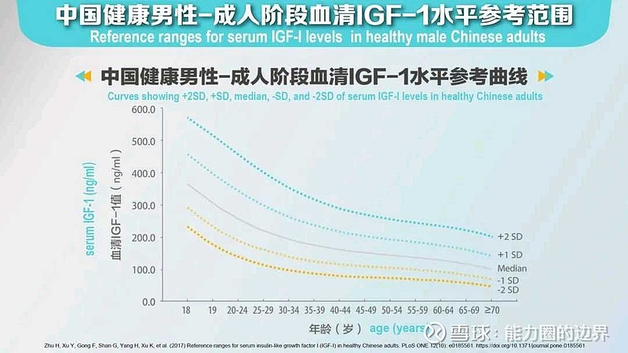

 从广义上讲，衰老是指生物体为保持高效运作而进行自我防御、维护和修复的内在[功能逐渐衰退](https://www.ncbi.nlm.nih.gov/pmc/articles/PMC2685272/)。 [大脑](https://www.ncbi.nlm.nih.gov/pmc/articles/PMC2596698/)对衰老的影响特别敏感，衰老会导致其大小、血管系统和认知能力出现变化。 随着年龄的增长，罹患某些神经系统疾病的风险也随之增加，比如阿尔茨海默病。

**抗衰老策略之细胞重编程**

是否可以在细胞层面让时光倒流？ [细胞重编程](https://clinicalepigeneticsjournal.biomedcentral.com/articles/10.1186/s13148-021-01158-7)旨在通过将终末分化的成熟细胞转化为诱导多能干细胞来实现这一目标。 通过以这种方式对细胞进行重编程，我们可以有效改善衰老的多个标志，如线粒体功能障碍、端粒消减、表观遗传改变的变化、基因组不稳定性和衰老等。 虽然研究仍处于早期阶段，但这种方法[已在临床前模型中显示出前景](https://clinicalepigeneticsjournal.biomedcentral.com/articles/10.1186/s13148-021-01158-7#Sec6)。

来源：重新想象衰老：探索抗衰老治疗策略的潜力 | CAS
https://www.cas.org/zh-hans/resources/cas-insights/xinxingkexue/zhongxinxiangxiangshuailaotansuokangshuailaozhiliaoceedeqianli ^jr51sw

部分重编程也应用于早衰小鼠体内，在没有畸胎瘤形成的情况下延长了它们的寿命。当在自然衰老的中年小鼠中重复实验时，损伤后肌肉和胰腺的再生能力以及葡萄糖耐量得到改善（图[1B](https://clinicalepigeneticsjournal.biomedcentral.com/articles/10.1186/s13148-021-01158-7#Fig1)；[ \[74\] ](https://clinicalepigeneticsjournal.biomedcentral.com/articles/10.1186/s13148-021-01158-7#ref-CR74 "奥坎波 A 等人。 通过部分重编程在体内改善与年龄相关的特征。 细胞。 2016；167：1719–33。")）。

来源：Cellular reprogramming and epigenetic rejuvenation | Clinical Epigenetics | Full Text
https://clinicalepigeneticsjournal.biomedcentral.com/articles/10.1186/s13148-021-01158-7#Sec6

一旦发生生长激素分泌不足，亚健康、疾病和衰老带来的问题也接踵而至，比如容易疲倦，皮肤粗糙，难以入睡，性欲低下，记忆力下降，骨骼肌减少、脂肪增加、骨质流失、免疫功能受损等等，更重要的是，生活质量的下降  
  

来源：另辟蹊径，一种新型且高效的抗老方式 以下内容引自：AMWC世界抗衰老大会 2023-10-10 18:53 发表于上海的《另辟蹊径，一种新型且高效的抗老方式... - 雪球
https://xueqiu.com/3902829679/262837280

