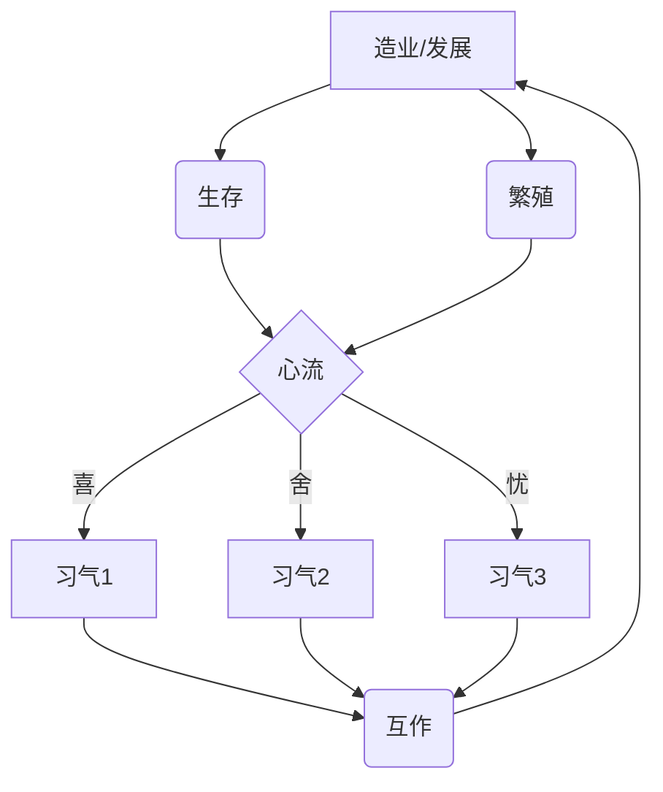

## 业力的流动

```mermaid 业力的流动
graph TD
A[造业/发展] --> B(生存)
A[造业/发展] --> B1(繁殖)
    B --> C{心流}
    B1 --> C{心流}
    C --> |喜| D[习气1]
    C --> |舍| D1[习气2]
    C --> |忧| D2[习气3]
D -->E(互作)
D1 -->E
D2-->E
E-->A
   
```

